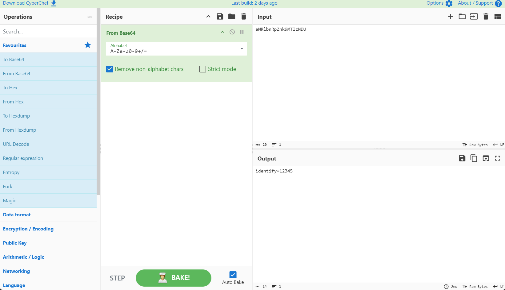

# Phishing Email Analysis & IoC Extraction Workflow

## Project Overview
This project simulates an operational **SOC Level 1 Incident Response** workflow for investigating suspected phishing emails. The goal is to analyze email headers, assess domain authentication protocols (SPF, DKIM, DMARC), extract Indicators of Compromise (IoCs), and decode obfuscated payloads using CyberChef and MXToolbox.

## Investigation Methodology & Triage
1. **Header Analysis:** Inspected raw MIME headers to verify sender legitimacy and identify originating server IPs.
2. **Authentication Audit:** Evaluated `SPF`, `DKIM`, and `DMARC` alignment mechanisms to confirm domain spoofing.
3. **Payload & IoC Extraction:** Isolated malicious URLs, analyzed domain reputation (TLD assessment), and decoded obfuscated tracking parameters.

## Extracted Indicators of Compromise (IoCs)

| IoC Category | Value | Triage Analysis |
| :--- | :--- | :--- |
| **Header Sender** | `support@bank-security-alert.com` | Spoofed domain identity |
| **Source IP** | `192.0.2.45` | Unauthorized relay IP (Failed SPF/DMARC) |
| **Phishing URL** | `login.verification-portal-secure.ru` | Suspicious TLD / External Credential Harvester |
| **Decoded Token** | `identify=12345` | Base64 encoded victim identifier parameter |

## Key Evidence

### Payload Decoding via CyberChef

*Figure 1: CyberChef Base64 payload decoding and IoC extraction pipeline.*

## Key Competencies Demonstrated
* **Email Forensics:** Analyzing MIME structure, `Received` paths, and mail transfer agent (MTA) headers.
* **Authentication Verification:** Diagnosing SPF/DKIM/DMARC failures during spoofing attempts.
* **Incident Triage:** Categorizing threat indicators to streamline containment and SOC escalation workflows.
